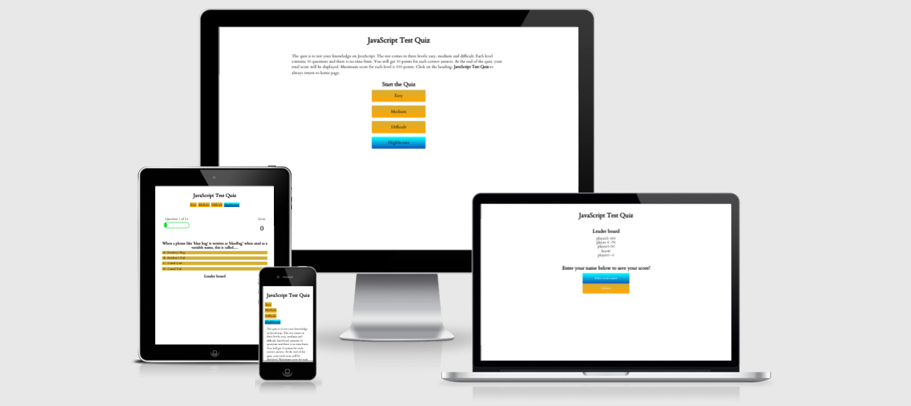
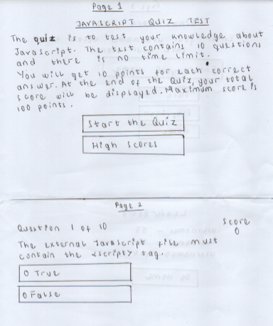
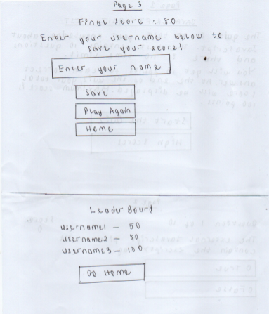
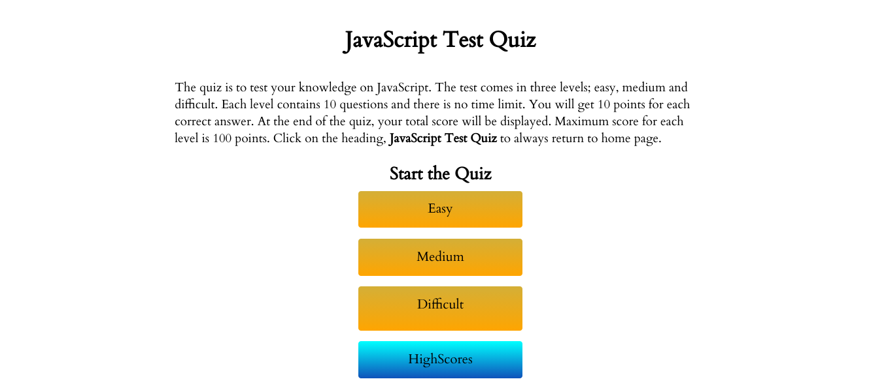
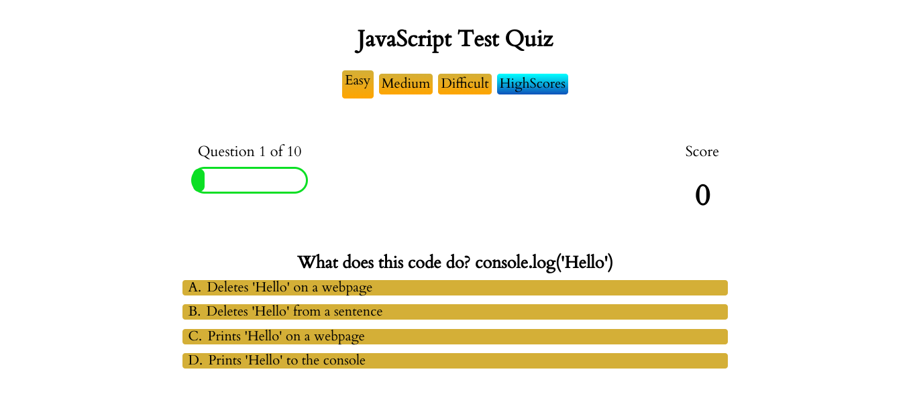
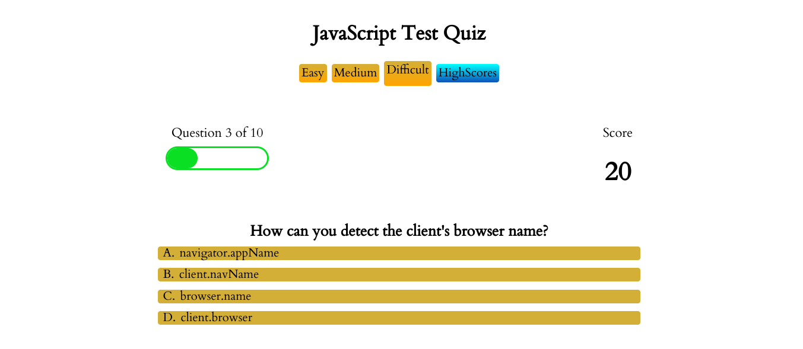
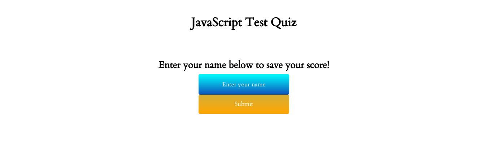
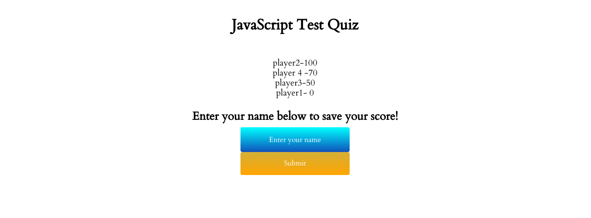

# JAVASCRIPT QUIZ TEST
JavaScript quiz test was created to test users knowledge on JavaScript with no time limit.  It comes in three levels; easy, medium and difficult. For each level, there are 10 questions and users will get 10 points for each correct answer.  At the end of the quiz, the total score will be displayed. Maximum score for each level is 100 points. The user has to input a username for the score to be saved. At the end page, there is a leader board that displays the highest scores. 

# FINAL DESIGN

# WIREFRAME
* This was the initial idea sketched on a paper. Changes were made during the process of creating the project. 

# USER EXPERIENCE(UX) / SITE GOALS
* The game was created using my knowledge on HTML, CSS and JAVASCRIPT.
* The game was created to test and improve users knowledge in JavaScript.
* Part of the site goals is to make the game easily accessible, providing interactive buttons that are clear as to what they do. 
* The users are provided with some introductory text to familiarise the user with the game. 

# EXISTING FEATURES
## The Landing Page
* Featured at the home page is the title, JavaScript Quiz Test and some brief description to familiarise the user with the game.  
* Beneath this are the navigation links to start each level of the quiz; easy, medium and difficult.
* There is also a High Scores navigation link to display to top five high scores with the players usernames. 

## The Easy Game Level
* Clicking on the easy game navigation, the user is directed to another page that displays the easy game questions. 
* On the top of the page again  is the title, JavaScript Quiz Test. Clicking on this takes the user back to the home/landing page. 
* Beneath the title are the links ; easy, medium, difficult and high scores again to allow users navigate and interact easily with the site. 
* Beneath the navigation links, at the left side is a score tracking system. This displays the question number and a bar which increases after each question. 
* Beside this is the Score which increases by 10 points for each correct answer. The score remains the same and is not increased if the user gets the answer wrong. 
* Next is the question displayed with four options to chose from. 
* The user is directed to the next question after choosing an answer. 

## The Medium and Difficult Game Level
The medium and difficult game level has pretty much the same features as the easy game level, except that the questions for each level are different and more challenging. 

## The End Page
* The user is directed to an end page after playing each level. The user has to input a username to save the game.

## The High Scores
* Featured in the high scores is a leader board showing the top 5 high scores and their respective usernames. 

# DESIGN
## Color Scheme
I wanted a simple and basic color scheme, using a white background for all pages, a gold shade for the level navigation links, a blue shade for the high scores navigation and a green color for the progress bar. 
## Typography
The "Cardo" font used for the site was imported from [Google Fonts](https://fonts.google.com/).

# TECHNOLOGY USED
* Google Fonts: Google Fonts was used to import the fonts used for all the text content on the site pages.
* Git: Git was used for version control by using the Gitpod terminal to commit to Git and push to GitHub.
* GitPod: GitPod was used as an IDE whilst coding this site.
* GitHub: GitHub is being used to store all the code for this project after being pushed from GitPod.
* Am I Responsive: Am I Responsive was used to create the images in the Final Design section.
* Chrome Developer Tools: Chrome Developer Tools was used for trouble shooting and trying new visual changes without it affecting the current code.

# SOLVED BUGS

TESTING
* I tested that this page works in different browsers.
* I have ensured that this project is responsive, looks good and functions on all standard screen sizes using the devtools device toolbar.
* I have confirmed that all texts are readable and easy to understand.

# VALIDATOR TESTING
The [W3C Markup Validator](https://validator.w3.org/nu/?doc=https%3A%2F%2Foyindamolabadara.github.io%2Fjavascript-quiz-test%2F#textarea) and [W3C CSS Validator](https://jigsaw.w3.org/css-validator/validator) and [JSHint] (https://jshint.com/) was used to validate my project to make sure no major errors were returned.

# LIGHTHOUSE
I ran the game live through Chrome Lighthouse and received the following result:

# SOLVED BUGS

# UNSOLVED BUGS

# DEPLOYMENT
* The site was deployed to GitHub pages. The steps to deploy are as follows:
  * In the GitHub repository, navigate to the Settings tab.
  * From the source section drop-down menu, select the Master Branch.
  * Once the master branch has been selected, the page will be automatically refreshed with a detailed ribbon display to indicate the successful deployment.
[The live link can be found here.]() 

# CREDITS
Most of the quiz questions were taken from the (W3 Schools Website) with some adjustments. 

# ACKNOWLEDGEMENTS
I would like to thank [AbdulFattah Badara](https://github.com/fobadara) and my Code Institute mentor, [Anthony Ugwu](https://github.com/tonyguesswho) for all their support, patience, encouragement and corrections during this project. I could not have done this without them. 
